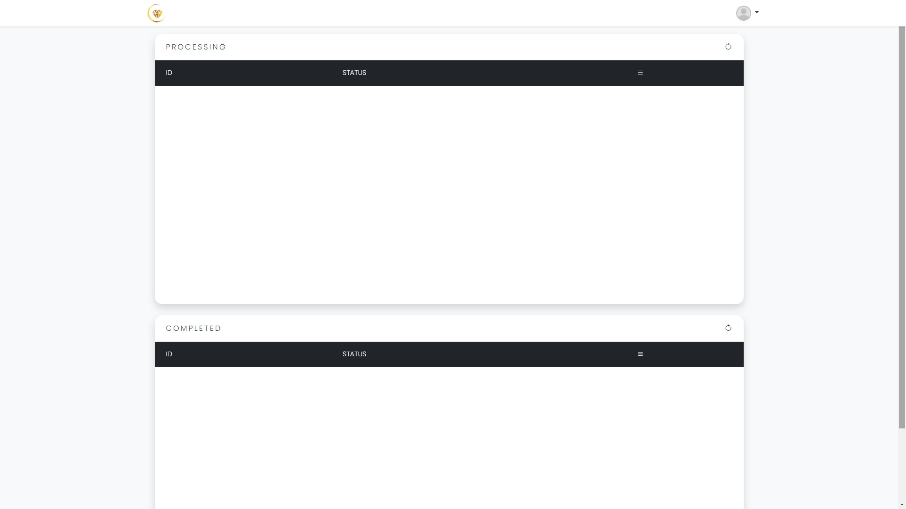

# Online Ordering and Inventory Management

A comprehensive e-commerce platform, optimized for both desktop and mobile use, designed to meet the needs of customers, business administrators, and logistics personnel through distinct, intuitive panels:

## Customer Panel

Users can effortlessly browse through a wide range of products, add their desired items to the cart, and complete their orders with ease. The platform provides a seamless shopping experience, ensuring customer satisfaction at every step.

## Manager Panel

Managers have powerful tools to oversee product listings, manage orders efficiently, and control the locations available for delivery. They can also access detailed sales statistics, enabling data-driven decision-making to optimize business performance.

## Driver Panel

Drivers can manage their deliveries by adding the products they need to deliver and updating the status once the products have been successfully delivered, ensuring transparency and efficiency in the delivery process.

## System Admin Panel

System administrators have full control over user accounts, with the ability to create new accounts or block existing ones to maintain security and integrity across the platform.

## Technologies Used

- **HTML**
- **CSS**
- **JavaScript**
- **PHP**
- **MySQL**
- **jQuery**
- **Bootstrap**
- **Chart.js**
- **Html5-QRCode**
- **anime.js**
